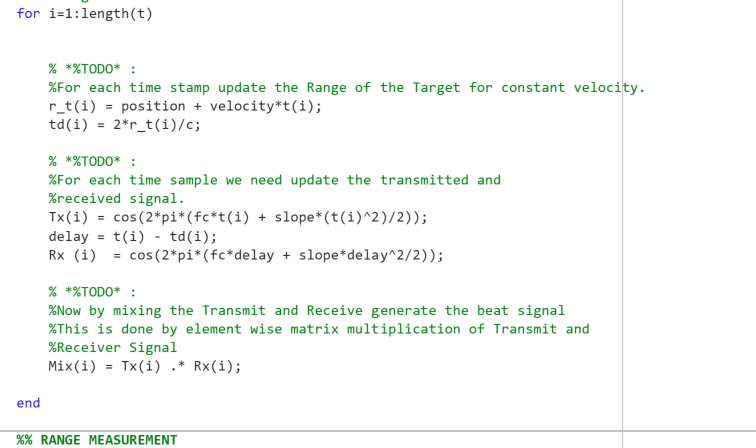
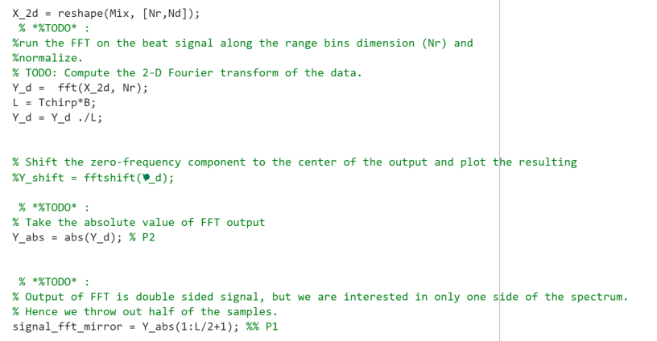
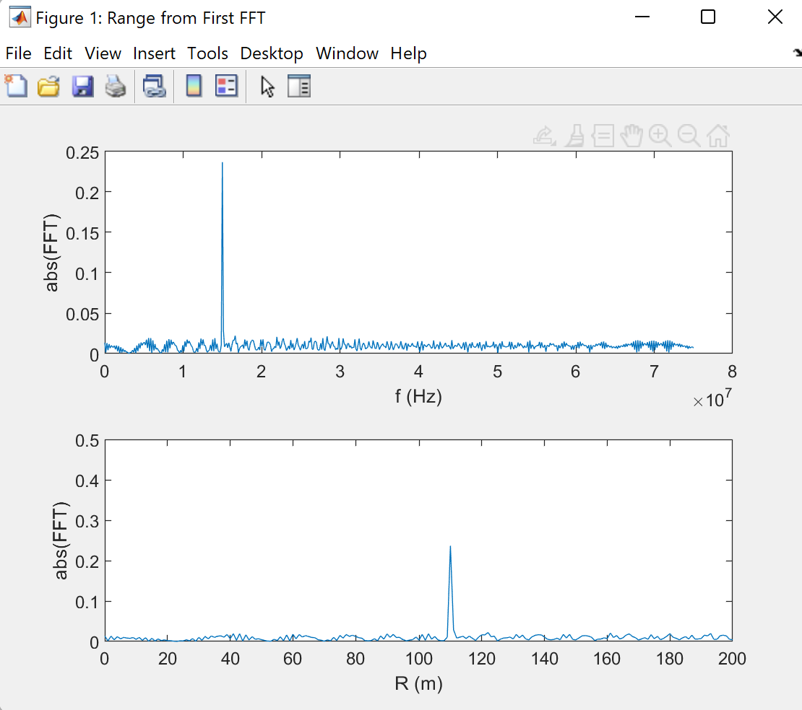
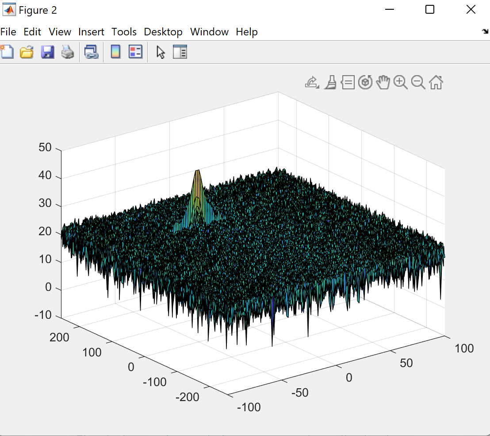
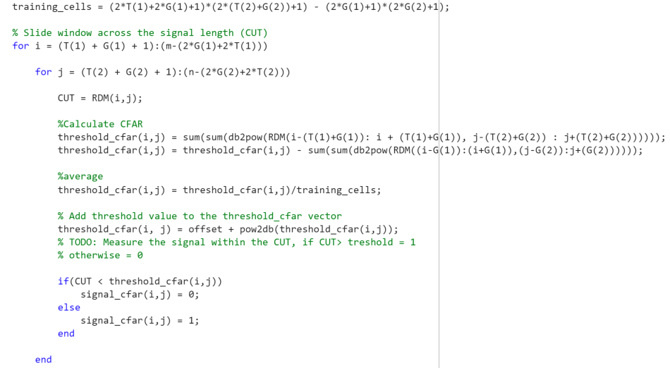

# SFND Radar Target Generation and Detection

Welcome to the Radar Project in which Fast Fourier Transform and 2D constant False Alarm Rate were implemented to understand the data gathered by a radar sensor.

#Steps
1. Target Generation and Detection:
For the waveform we needed to calculate Bandwidth, Time Chirp and Slope
Carrier frequency = 77 GHz
Number of doppler cells = 128
Number of samples = 1024

B = c/(2*RadarResolution)
Tchirp = 5.5*2(max_Radar_range/c)
Slope = B/TChirp

c = speed of light, the medium in which the signals from lidar travels = 3*10^8

Radar Resolution = 1m
max velocity = 70 m/s
max range = 200m

The position was updated by a simple deltaDistance calculation
Position = CurrentPos+Vel + timeStep

and the initial position was 110 m, velocity = -20 m/s

2. FFT Operation
The Fast Fourier Transform was calculated in 1D, 2D was calculated later in the given code.

The complete Mix Tx*.Rx was taken and computed along dimension Nr, taken the absolute and using only the positive side of th spectrm
Range and Plot is seen on the following image. We can see a bump on the initial position of out object, in this case, 110 m.

2D FFT was calculated with the given code

3. 2d CFAR

Finally, the complex part. Training cells were calculated with the given function:
TC = (2*Tr++2*Gr+1)*(2*(Td+Gd)+1) - (2*Gr+1)*(2*Gd+1)

2 Loops had to go over the doppler and range cells to calculate the treshold and if CUT signal (RDM(i,j)) > treshold, signal = 1, otherwise = 0

